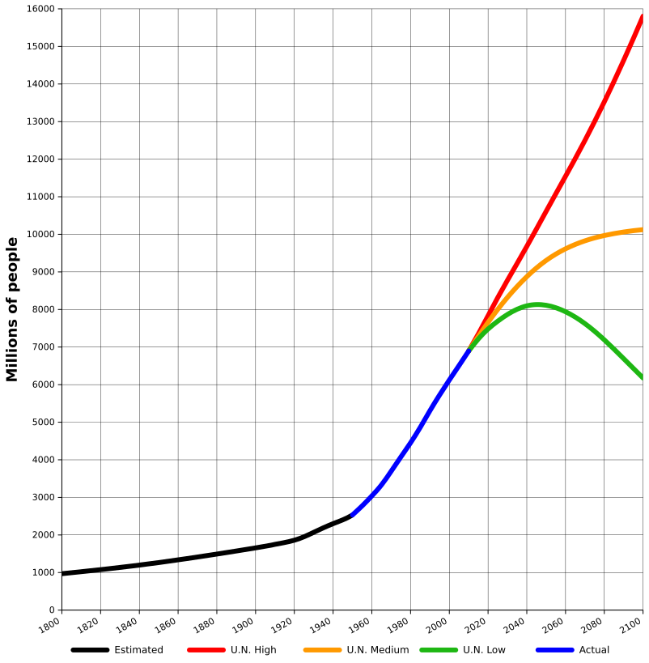

## Organization of the class

- **5 weeks**
- Each week, we pick **a theme** 
- We explore **data**, **concepts**, and **mathematical models** on the theme
- We stress **ecological thinking**

You can find all the material (slides, data, code, papers) on the website for the class

[**github.com/StefanoAllesina/Bios20150**](https://github.com/StefanoAllesina/Bios20150)

## Theme 1: Growth

<div class="centered">
<h2>How many people can the Earth support?</h2>
</div>

<div class="centered">
<h2> </h2>
</div>

<div class="centered">
**I was ever of opinion, that the honest man who married and brought up a large family, did more service than he who continued single, and only talked of population.** *The Vicar of Wakefield (1776) by Oliver Goldsmith*
</div>


## Human growth: historical time series

```{r echo = FALSE}
sliderInput(
  "range_years", 
  label = "Years",
  min = -1000, 
  max = 2100, value = c(-1000, 2100))
```
```{r echo = FALSE}
library(ggplot2)
library(ggthemes)
library(grid)
library(gridExtra)
library(scales)

renderPlot(height = 400, {
    human_pop <- read.csv("../../data/theme_1/world_population.csv", stringsAsFactors = FALSE)
    min_max <- input$range_years
    to_draw <- human_pop[(human_pop$year >= min_max[1]) & (human_pop$year <= min_max[2]),]
    if (dim(to_draw)[1] <= 2){
      to_draw <- human_pop
    }
    # by default only plot the population
    pl <- ggplot(to_draw, aes(x = year, y = world_population, colour = reference)) + 
      geom_point() + 
      geom_line() + 
      scale_x_continuous("Year",  limits = min_max) + 
      scale_y_log10("Population (millions)") + 
      theme_bw() + 
      theme(legend.title=element_blank()) + 
      theme(legend.position = "top")
    print(pl)
})
```

## Why do we care?
```{r echo = FALSE}
renderPlot(height = 400, {
  human_pop <- read.csv("../../data/theme_1/world_population.csv", stringsAsFactors = FALSE)
pl_zoom_human <- ggplot(human_pop, aes(x = year, y = world_population, colour = reference)) + 
      geom_point() + 
      geom_line() + 
      scale_x_continuous("Year",  limits = c(1800, 2011)) + 
      scale_y_continuous("Population (millions)") + 
      theme_bw() + 
      theme(legend.title=element_blank()) + 
      theme(legend.position = "top")
    print(pl_zoom_human)})
```

## Why do we care?
```{r echo = FALSE}
carbon <- read.csv("../../data/theme_1/carbon.csv")
renderPlot(height = 400, {
pl_zoom_carbon <- ggplot(carbon, aes(x = year, y = carbon)) + 
      geom_point() + 
      geom_line() + 
      scale_x_continuous("Year",  limits = c(1800, 2011)) + 
      scale_y_continuous("Carbon emission (Million metric tons)") + 
      theme_bw() + 
      theme(legend.title=element_blank()) + 
      theme(legend.position = "top")
    print(pl_zoom_carbon)})
```

## Estimates for 2100
<div class="centered">

</div>

## Fibonacci

Leonardo Pisano (a.k.a. Fibonacci) was the son of a trader from Pisa. 
In 1192, he followed his father to Bejaia, Algeria, where he studied
the number systems the Arabs had brought from India. This is the decimal
system we use today.

In 1202 he published the *Liber Abaci* where he introduced the number system
that rapidly spread through Europe. The book contains a problem on the growth
of the growth of rabbits, giving raise to the famous Fibonacci's sequence.

<div class="centered">

</div>

## Rabbits {.build}
Take a couple of rabbits.
<div class="centered">

</div>
They're fully grown in one month.
<div class="centered">

</div>
The next month they reproduce: a new pair of rabbits!
<div class="centered">
 
</div>
They reproduce again, while their offspring matures:
<div class="centered">
  
</div>

## Many rabbits!

In a few years, the Earth would be scorched by hordes of rabbits!

$N_t = N_{t-1} + N_{t - 2}$

```{r echo = FALSE}
nmonths <- 50
months <- 1:nmonths
rabbits <- rep(0, nmonths)
rabbits[1:2] <- c(1,1)
for (i in 3:nmonths) rabbits[i] <- rabbits[i - 1] + rabbits[i - 2]

mytable <- matrix(0, 2, nmonths)
mytable[1, ] <- months
mytable[2, ] <- rabbits
rownames(mytable) <- c("Months", "Pairs")
colnames(mytable) <- NULL
print(mytable[,1:12])

library(ggplot2)
plrabbits <- ggplot(data = data.frame("Months" = months, "Pairs" = rabbits), aes(x = Months, y = Pairs)) + 
  geom_point(size = 3) + geom_line() + 
  scale_y_log10() + 
  theme_bw() + 
  theme(legend.title=element_blank()) + 
  theme(legend.position = "top") + 
  theme(axis.text=element_text(size=14, face="bold"),
  axis.title=element_text(size=14, face="bold"))
renderPlot(height = 270,
print(plrabbits)
)
```

## Geometric growth

The Swiss mathematician Euler (1707-1783) has left an indelible mark on science, publishing fundamental works in a number of mathematical disciplines. He became interested in the growth of populations because of what he read (and believed) in the Bible:

*These three were the sons of Noah; and from these the whole earth was peopled* (Genesis 9:19)

How long would it take to the sons of Noah to "people" the Earth? Euler considered the following model:

$N_t = (1 + x) N_{t-1}$

$x$ is called the *annual growth rate* of the population. Starting from a certain population size (i.e., knowing $N_0$), we can project forward:

$N_1 = (1 + x) N_0$

$N_2 = (1 + x) N_1 = (1 + x)^2 N_0$

$N_3 = (1 + x) N_2 = (1 + x)^3 N_0$

$\ldots$

## Geometric growth

In his treatise *Introduction to the Analysis of the Infinite* (1748), Euler wrote:

*Since after the Flood all men descended from a population of six, if we suppose that the population after two hundred years was 1,000,000, we would like to find the annual rate of growth.*

Mathematically, you want to solve for $x$:

$N_{200} = (1 + x)^{200} N_0$

$10^6 = (1 + x)^{200} 6$

This looks very easy to solve, but it is not, if you don't have a calculator! Euler exploited a very recent invention, the table of logarithms (introduced by Napier in 1614):

$\log_{10} (10^6) = \log_{10}((1 + x)^{200} 6)$

$(6 - log_{10}(6)) / 200 = \log_{10} (1 + x)$

yielding $x \approx 0.0619$, meaning about $6.2\%$ per year. Not an unrealistic result according to Euler, who concluded:

*For this reason, it is quite ridiculous for the incredulous to object that in such a short space of time the whole earth could not be populated beginning with a single man*

## Geometric growth?

Interestingly, Euler repeated his calculation projecting forward of 400 years (instead of 200), and found that it would lead to more that 166 billion humans. He noted:

*However, the whole earth would never be able to sustain that population.*

Hold this thought, as we're going to explore it later.

## Just how fast is geometric growth?

Meet *Escherichia coli*, a Gram-negative bacterium that lives in your intestine (and in many other places). Some strains of *E. coli* can cause serious food poisoning.

<div class="centered">
 
</div>

Under ideal conditions, it can reproduce every 20 minutes (72 times per day). Each cell weighs about $10^{-15}$kg.

We can write an equation for the mass of a population of *E. coli*, starting with a single bacterium, at time $d$ days:

$M_d = M_0 2^{72 d}$

and project forward

## *E. coli* colony growth

```{r echo = FALSE}
mass_earth <- 5.9721986 * 10^24
mass_sun <- 1.988435 *10^30
mass_solar <- 1.9912 * 10^30 
mass_universe <- 3.4 * 10^54
mass_you <- 70
m0 <- 10^(-12)
lm0 <- log(m0)
step <- 1 / 72
times <- seq(0, 3, by = step)
dfcoli <- data.frame(time = times, mass = exp(72 * times * log(2) + lm0))
require(ggplot2)
plcoli <- ggplot(dfcoli, aes(x = time, y = mass)) + 
  geom_line(colour = "red", size = 2) + 
  scale_y_log10("Mass (kg)") + 
  scale_x_continuous("days") +
  geom_hline(yintercept = mass_you, colour = "black", linetype="dashed") + 
  annotate("text", x = 0.5, y = 1000, label = "you") + 
  geom_hline(yintercept = mass_earth, colour = "black", linetype="dashed") + 
  annotate("text", x = 0.5, y = 10^23, label = "mass of the Earth") + 
  geom_hline(yintercept = mass_sun, colour = "black", linetype="dashed") + 
  annotate("text", x = 0.5, y = 10^33, label = "mass of the Sun") + 
  geom_hline(yintercept = mass_universe, colour = "black", linetype="dashed") + 
  annotate("text", x = 0.5, y = 10^52, label = "mass of the visible universe") + 
  theme_bw() + 
  theme(legend.title=element_blank()) + 
  theme(legend.position = "top") + 
  theme(axis.text=element_text(size=14, face="bold"), 
  axis.title=element_text(size=14, face="bold"))
renderPlot(height = 500,
print(plcoli))
```

## Synchronized births

- Reproduction is synchronized in many animals and plants.

- Besides obvious seasonal effects, there might be more subtle causes leading to clustering in births (see Ims, 1990).

- These include phenological (e.g., pollinators hatch when plants are flowering), ecological (e.g., escape predators), and sociobiological (e.g., cooperative breeders).

- One of the most amazing cases is that of the banded mongoose (*Mungos mungo*): within a group, 64% of the births happen in the same night! (The reason for this is not very romantic: read Hodge *et al.* 2010).

<div class="centered">
 
</div>

## Births by day in US 1969-88 (50 states and DC)
```{r echo = FALSE}
num_births_by_day <- read.csv("../../data/theme_1/births_69_88.csv")
birthdays <- as.Date(paste(num_births_by_day$month, num_births_by_day$day, "1969"), "%m %d %Y")
pl_birthdays_nohigh <- ggplot(data = data.frame(date_b = as.Date(birthdays), 
                                         number_of_births = num_births_by_day$births), 
                       aes(x = date_b, y = number_of_births)) + 
  geom_point() + 
  theme_bw() + 
  theme(axis.text=element_text(size=14, face="bold"), axis.title=element_text(size=14, face="bold")) +
  scale_x_date("", labels = date_format("%b")) + 
  scale_y_continuous("Number of births (1969-1988)") + 
  annotate("text", x = birthdays[185], y = 175000, label = "Fourth of July", colour = "blue", alpha = 0) + 
  annotate("text", x = birthdays[5], y = 162000, label = "New Year", colour = "blue", alpha = 0) + 
  annotate("text", x = birthdays[359], y = 155000, label = "Xmas", colour = "blue", alpha = 0) + 
  annotate("text", x = birthdays[259], y = 215000, label = "38 weeks after Xmas", colour = "blue", alpha = 0) 
renderPlot(height = 450,
print(pl_birthdays_nohigh))
```

## Births by day in US 1969-88 (50 states and DC)
```{r echo = FALSE}
num_births_by_day <- read.csv("../../data/theme_1/births_69_88.csv")
birthdays <- as.Date(paste(num_births_by_day$month, num_births_by_day$day, "1969"), "%m %d %Y")
pl_birthdays <- ggplot(data = data.frame(date_b = as.Date(birthdays), 
                                         number_of_births = num_births_by_day$births), 
                       aes(x = date_b, y = number_of_births)) + 
  geom_point() + 
  theme_bw() + 
  theme(axis.text=element_text(size=14, face="bold"), axis.title=element_text(size=14, face="bold")) +
  scale_x_date("", labels = date_format("%b")) + 
  scale_y_continuous("Number of births (1969-1988)") + 
  annotate("text", x = birthdays[185], y = 175000, label = "Fourth of July", colour = "blue") + 
  annotate("text", x = birthdays[5], y = 162000, label = "New Year", colour = "blue") + 
  annotate("text", x = birthdays[359], y = 155000, label = "Xmas", colour = "blue") + 
  annotate("text", x = birthdays[259], y = 215000, label = "38 weeks after Xmas", colour = "blue") 
renderPlot(height = 450,
print(pl_birthdays))
```

## From discrete to continuous growth

$X(t + \Delta t) = X(t) (1 + r \Delta t)$

$X(t + \Delta t) - X(t) =  r \Delta t X(t)$

$\dfrac{X(t + \Delta t) - X(t)}{\Delta t} = r X (t)$

Take the limit $\Delta t \to 0$:

$\dfrac{d X(t)}{d t} = r X(t)$

## Exponential growth

Define initial population $X(0) = X_0$. 

We model the **growth rate** of the population as:

$\dfrac{d X(t)}{d t} = r X(t)$

**Meaning:**

- $\dfrac{d X(t)}{d t}$ growth rate of population at time $t$. [units: Kg / time]

- $X(t)$ biomass (alternatively number of individuals, density per square Km, etc.) at time $t$. [units: Kg]

- $r$ intrinsic growth rate [units: 1 / time]. $r>0$ means the population grows, $r<0$ shrinks, $r=0$ is constant.

**Solution:**

$X(t) = X(0) e^{r t}$

- $e$ is Euler's number $2.718281828459045235360287471352...$

## Doubling time

How long before the population doubles in size?

$X(\tau) = 2 X(0)$

$X(\tau) = X(0) e^{r \tau} = 2 X(0)$

Independent of $X(0)>0$!

$e^{r \tau} = 2$

$r \tau = \log(2)$

$\tau = \frac{log(2)}{r} = \frac{0.301029995...}{r}$

Thus, if $r = 0.01$, then the population doubles every 30 years or so; $r = 0.05$, every 6 years; and so on.

## Halving time and carbon dating

Unstable atoms release energy through radioactive decay. This process is random, and, at the level of the single atom, cannot be predicted. However, we can measure statistically  the rate at which atoms decay. The Carbon isotope $\mathrm{^{14}C}$ is formed in the athmosphere when cosmic rays strike Nitrogen atoms:

$n + \mathrm{^{14}_{7}N} \rightarrow \mathrm{^{14}_{6}C} + p$

Radioactive carbon forms $\mathrm{CO}_2$ that is used by plants. Animals eat plants, etc. so that it is widely distributed in the biosphere. When an organism dies, it stops acquiring  $\mathrm{^{14}_{6}C}$. In the athmosphere/living organisms, there are about $1.5$ atoms of $\mathrm{^{14}C}$ for every $10^{12}$ of $\mathrm{^{12}C}$. The radioactive carbon loses an electron, and changes a proton into a neutron by emitting an electron antineutrino, resulting in Nitrogen. 

$\mathrm{~^{14}_{6}C}\rightarrow\mathrm{~^{14}_{7}N}+ e^- + \bar{\nu}_e$

In about 5730 years, half of the radioactive carbon has decayed. Hence, $r = -log(2)/5730 = 0.000052535...$. If a tissue has only $0.75$ parts of $\mathrm{^{14}C}$ for every $10^{12}$ of $\mathrm{^{12}C}$, the tissue is 5730 years old. A proportion of of $0.25 / 10^{12}$ would yield 34380 years, and so forth.

This method was proposed by Willard Libby (UofC) and collaborators in 1949. They were awarded the Nobel prize in 1960.

## First law of ecology
<div class="centered">
<h4>If left unchecked, populations will grow/decay very fast!</h4>
</div>

<div class="centered">

</div>


**Example: rabbits (again)**

- Lore has it, Thomas Austin released 24 rabbits in his property near Victoria (Australia) in 1859.

- By 1886, the population had covered Victoria and New South Wales.

- In the 1920s, they were billions.

- Efforts to contain rabbits included building three rabbit-proof fences (failed), releasing the virus for mixomatosis and rabbit  haemorrhagic disease. Read Bergstrom *et al.* 2009 for a detailed account on Macquarie Island in Tasmania.

## Limits to growth

Thomas R. Malthus (anonymously) published in 1978 a book entitled *An Essay on the Principle of Population, as It Affects the Future Improvement of Society, With Remarks
on the Speculations of Mr Godwin, Mr Condorcet and Other Writers*.

The central idea of the book is that human populations will grow until they reach the limit of starvation. This negative view of progress inspired subsequent work (esp. Darwin), and elicited strong reactions (esp. Marx).

*[...] the power of population is indefinitely greater than the power in the earth to produce subsistence for man. Population, when unchecked, increases in a  geometrical ratio. Subsistence increases only in an arithmetical ratio. A slight acquaintance with numbers will shew the immensity of the first power in comparison of the second. By that law of our nature which makes food necessary to the life of man, the effects of these two unequal powers must be kept equal. This implies a strong and constantly operating check on population from the difficulty of subsistence. This difficulty must fall somewhere; and must necessarily be severely felt by a large portion of mankind.*


In the second edition, titled *An Essay on the Principle
of Population, or a View of its Past and Present Effects on Human Happiness, With an Enquiry Into Our Prospects Respecting the Future Removal or Mitigation of the Evils Which It Occasions* Malthus expanded on the possible ways to keep populations in check, including war, famine, abortion, economic factors, and delayed marriage.

## Logistic growth

Inspired by Malthus, the Belgian mathematician Pierre-Francois Verhulst noted that there must be a limit to geometric growth, which can only be achieved in very special cases:

*We shall not insist on the hypothesis of geometric progression, given that it can hold only in very special circumstances; for example, when a fertile territory of almost unlimited size happens to be inhabited by people with an advanced civilization, as was the case for the first American colonies.*

He wrote a simple ordinary differential equation to describe the slowing down of growth at high population values:

$\dfrac{d X(t)}{d t} = r X(t) \left(1  - \dfrac{X(t)}{K} \right)$

This is now known as **logistic growth**, with $r$ representing the intrinsic growth rate of the population when at low abundance, and $K$ being the carrying capacity.

## Logistic growth: behavior
```{r echo = FALSE}
fluidRow(
  column(4,
  numericInput('x0', 'Initial density X(0)', 0.5,
                 min = 0, max = 100)),
  column(4,
       numericInput('r', 'Intrinsic growth r', 0.25,
                 min = 0, max = 100)),
  column(4,
      numericInput('K', 'Carrying capacity K', 5,
                 min = 0, max = 100))
)
```
```{r echo = FALSE}
library(deSolve)
library(reshape2)
renderPlot(height = 400, {
    logistic_growth <- function(time, state, params){
    with(as.list(c(state, params)), {
      dXdt <- r * X  * (1 - X / K)
      return(list(c(dXdt)))
      })
    }
    pars <- c(r = input$r, K = input$K)
    xini <- c(X = input$x0)
    times <- seq(0, 100, by = 0.05)
    out <- as.data.frame(ode(xini, times, logistic_growth, pars))
    m <- melt(out, id.vars = "time")
    pl_logistic <- ggplot(m, aes(x = time, y = value, colour = variable)) + 
      geom_line(size = 2, alpha = 0.7) + 
      scale_x_continuous("Time t") + 
      scale_y_continuous("X(t)", limits = c(0, NA)) +
      geom_hline(yintercept = input$K, linetype = 2, colour = "black") + 
      theme_bw() + 
      theme(axis.text=element_text(size=14, face="bold"), axis.title=element_text(size=14, face="bold")) +
      theme(legend.position = "none")
    print(pl_logistic)
})
```

## You can estimate parameters from data

You can solve the equation:

$X(t) = \dfrac{X(0) e^{r t}} {1 + X(0) (e^{r t} -1) / K}$

Take the population at three equally spaced points: $X_0$, $X_1$, $X_2$, each at $T$ time units apart. Then:

$K = X_1 \dfrac{X_0 X_1 + X_1 X_2 - 2 X_0 X_2}{X_1^2 - X_0 X_2}$

and 

$r = \dfrac{1}{T} \log \left( \dfrac{1/X_0 - 1 / K}{1/X_1 - 1 / K}\right)$

## Example: US Population

```{r echo = FALSE}
fluidRow(
  column(4,
       numericInput('yearstart', 'Starting date', 1660,
                 min = 1610, max = 1990, step = 10)),
  column(4,
      numericInput('spacing', 'T', 10,
                 min = 10, max = 100, step = 10))
)
```
```{r echo = FALSE}
renderPlot(height = 375, {
us_pop <- read.csv("../../data/theme_1/us_pop.csv")
year0 <- input$yearstart
year1 <- input$yearstart + input$spacing
year2 <- input$yearstart + 2 * input$spacing
X0 <- 1.0 * us_pop$Population[which(us_pop$Year == year0)]
X1 <- 1.0 * us_pop$Population[which(us_pop$Year == year1)]
X2 <- 1.0 * us_pop$Population[which(us_pop$Year == year2)]

K <- abs(X1 * (X0 * X1 + X1 * X2 - 2 * X0 * X2) / (X1^2 - X0 * X2))

r <- (1 / input$spacing) * log((1 / X0 - 1 / K) / (1 / X1 - 1 / K))

  yearshift <- us_pop$Year - year0
  predicted <- X0 * exp(r * yearshift) / (1 + X0 * (exp(r * yearshift) - 1) / K)
  us_pop$Predicted <- predicted
  pl_us_fit <- ggplot(data = us_pop, aes(x = Year, y = Population)) + geom_point() + geom_line(aes(x = Year, y = Predicted), colour = "red")  + geom_point(x = year0, y = X0, colour = "red") + geom_point(x = year1, y = X1, colour = "red") + geom_point(x = year2, y = X2, colour = "red") + theme_bw() + 
      theme(axis.text=element_text(size=14, face="bold"), axis.title=element_text(size=14, face="bold")) +
      theme(legend.position = "none")
    
  print(pl_us_fit)
})
```


## Interesting cases

$\dfrac{d X(t)}{d t} = r X(t) \left(1  - \dfrac{X(t)}{K} \right)$

When $X \approx 0$, then we can approximate:

$\dfrac{d X(t)}{d t} = r X(t) - \dfrac{r X(t)^2}{K} \approx r X(t)$

...exponential growth!

When $X \approx K$, then the growth rate is close to zero (equilibrium, or steady-state).

When $X > K$, then the growth is negative.


## Equilibria

For which values of $X(t)$ does $\dfrac{d X(t)}{d t} = 0$?
```{r echo = FALSE}
fluidRow(
  column(4,
       numericInput('r1', 'Intrinsic growth r', 0.25,
                 min = 0, max = 100)),
  column(4,
      numericInput('K1', 'Carrying capacity K', 5,
                 min = 0, max = 100))
)
```
```{r echo = FALSE}
renderPlot(height = 375, {
  Xs <- seq(0, 1.15 * input$K1, length.out = 100)
  growth_rate_logistic <- data.frame(X = Xs, dXdt = input$r1 * Xs * (1 - Xs / input$K1))
  eq_logistic <- ggplot(growth_rate_logistic, 
                        aes(x = X, y = dXdt)) + 
      geom_line(size = 2, alpha = 0.5, colour = "black") +
      scale_x_continuous("X(t)") + 
      scale_y_continuous("dX(t)/dt") +
      geom_point(x = 0, y = 0, shape = 1, size = 4) +
      geom_point(x = input$K1, y = 0, shape = 1, size = 4) +
    geom_hline(yintercept = 0) + 
    geom_vline(xintercept = 0) + 
      theme_bw() + 
      theme(axis.text=element_text(size=14, face="bold"), axis.title=element_text(size=14, face="bold")) +
      theme(legend.position = "none")
    print(eq_logistic)
})
```

## Stability

Will the population go back to the equilibrium if perturbed?

```{r echo = FALSE}
fluidRow(
  column(4,
       numericInput('r2', 'Intrinsic growth r', 0.25,
                 min = 0, max = 100)),
  column(4,
      numericInput('K2', 'Carrying capacity K', 5,
                 min = 0, max = 100))
)
```
```{r echo = FALSE}
renderPlot(height = 375, {
  Xs <- seq(0, 1.15 * input$K2, length.out = 100)
  growth_rate_logistic <- data.frame(X = Xs, dXdt = input$r2 * Xs * (1 - Xs / input$K2))
  eq_logistic <- ggplot(growth_rate_logistic, 
                        aes(x = X, y = dXdt)) + 
      geom_line(size = 2, alpha = 0.5, colour = "black") +
      scale_x_continuous("X(t)") + 
      scale_y_continuous("dX(t)/dt") +
      geom_point(x = 0, y = 0, shape = 16, size = 4, colour = "darkred") +
      geom_point(x = input$K2, y = 0, shape = 16, size = 4, colour = "darkgreen") +
      geom_hline(yintercept = 0) + 
      geom_vline(xintercept = 0) + 
      theme_bw() + 
      theme(axis.text = element_text(size = 14, face = "bold"), axis.title = element_text(size=14, face="bold")) +
      theme(legend.position = "none") + 
      geom_segment(aes(x = 0 + 1/5 * input$K2, 
                     y = input$K2 * input$r2 / 24, 
                     xend = 4/5 * input$K2, 
                     yend = input$K2 * input$r2 / 24),
                    arrow = arrow(length = unit(0.03, "npc"))) + 
      geom_segment(aes(x = 1.15 * input$K2, 
                     y = input$K2 * input$r2 / 24, 
                     xend = 1.01 * input$K2, 
                     yend = input$K2 * input$r2 / 24),
                    arrow = arrow(length = unit(0.03, "npc")))

    print(eq_logistic)
})
```

## What's carrying capacity?

## Intra-specific competition

## Second law of ecology

## Demographic transition

## Technological changes

## Conclusions