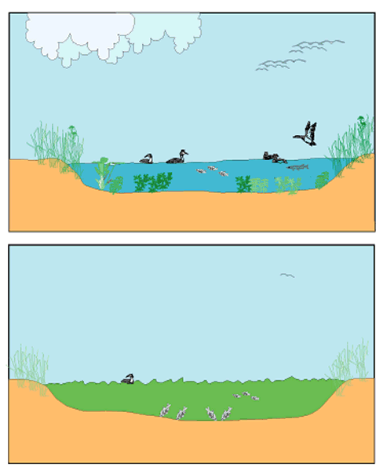
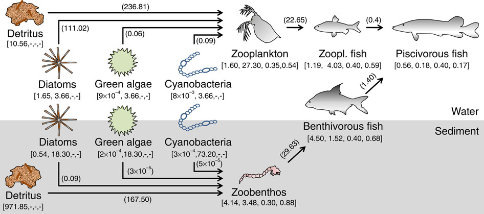
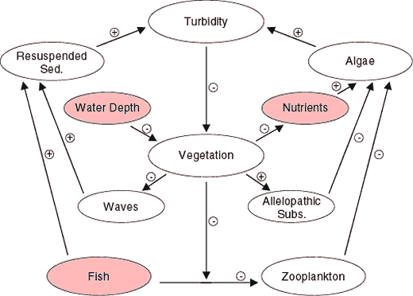
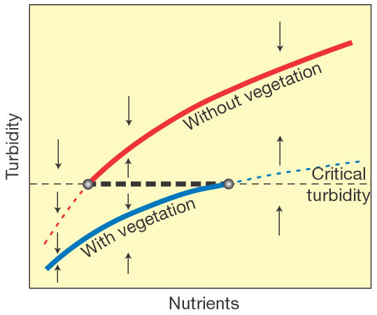
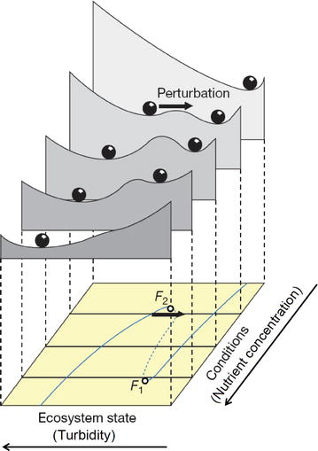

## Can ecological systems experience abrupt, catastrophic shifts?

<div class="centered">
**Many aquarium keepers [...] are unable to resist the temptation of slipping just one more fish into the container [...] And just this one more fish may be the final straw that breaks the camel's back. With too many animals in the aquarium, a lack of oxygen ensues. Sooner or later some organism will succumb to this and its death may easily pass unnoticed. The decomposing corpse causes an enormous multiplication of bacteria in the aquarium, the water becomes turbid, the oxygen content decreases rapidly, then further animals die and, through this vicious circle, the whole of our carefully tended little world is doomed. [...] what some days ago was a beautiful, clear pool with healthy growing plants and lively animals becomes a horrid, stinking brew.**

*King Solomon's Ring (1949) by Konrad Lorenz*
</div>

## Analogy: wateshed map

<div class="centered">

</div>

## Analogy: rubber band

<div class="centered">

</div>

## Analogy: rubber band

<div class="centered">

</div>

**Triana and Fajardo, European Journal of Physics, 2012**

## Bistability

A dynamical system is **bistable** if it has **two equilibrium states**. 

Bistability is a special case of systems with multiple **alternative stable states**.

<div class="centered">

</div>

*By Georg Wiora, CC BY-SA 3.0, commons.wikimedia.org/w/index.php?curid=810601*

## Case study: shallow lakes

<div class="centered">

</div>

*Scheffer, Conservation Ecology, 1999*

## Shallow lake food web

<div class="centered">

</div>

*Kuiper et al., Nature Communications, 2015*

## Important processes

<div class="centered">

</div>

*Scheffer, Conservation Ecology, 1999*

## Result: critical point

<div class="centered">

</div>

*Scheffer et al., Nature, 2001*


## Bifurcation

<div class="centered">

</div>

*Scheffer et al., Nature, 2001*

## Maximum Sustainable Yield

Take the logistic model:

We introduce a term

## Dai et al. Science 2012, Results
```{r echo = FALSE, message=FALSE, warning=FALSE}
library(dplyr)
library(ggplot2)
library(tidyr)
dai_data <- read.csv("../../data/theme_2/DaiEtAl_Science2012_data.csv", sep = " ")

pl_bifurc <- ggplot(dai_data %>% filter(dilution == 250 | dilution == 750 | dilution == 1266 | dilution == 1400), 
             aes(x = day, y = value, colour=extinction, group = paste(initial_density, replicate))) + 
  geom_line() + 
  facet_wrap(~dilution) + 
  scale_y_sqrt() + 
  scale_color_manual(values = c("#045a8d", "#b30000")) + 
  theme_bw() + theme(legend.position = "none")
show(pl_bifurc)
```

## Growth rates
```{r echo = FALSE, message=FALSE, warning=FALSE}
library(dplyr)
library(ggplot2)
library(tidyr)
dai_data <- read.csv("../../data/theme_2/DaiEtAl_Science2012_data.csv", sep = " ")

data_growth <- dai_data %>% group_by(dilution, replicate, initial_density) %>% arrange(dilution, replicate, day) %>% mutate(y =  lead(value) / value) %>% ungroup()

pl_growth <- ggplot(data = data_growth %>% filter(dilution == 250 | dilution == 750 | dilution == 1266 | dilution == 1400), 
                   aes(x = value, y = y, colour = y > 1)) + 
  geom_point() +
  facet_wrap(~dilution) + 
  scale_x_log10(expression(N[t])) + 
  scale_y_log10(expression(N[t+1]/N[t])) + 
  coord_cartesian(ylim = c(0.1, 15), xlim = c(0.01, 2)) + 
  scale_color_manual(values = c( "#b30000", "#045a8d")) + 
  theme_bw() + theme(legend.position = "none") + 
  geom_hline(yintercept = 1) 

show(pl_growth)
```

## Allee effect

## A model


## MSY with Allee effect

## Collapse of Cod

## Bistability

## Example: shallow lakes

## Hysteresis

## Example: brewer's yeast

## Other biological cases

## Predicting the approaching of tipping points

## Expecting the unexpected

## Conclusions