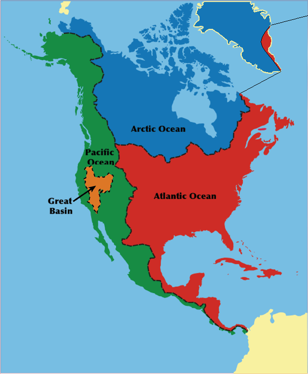
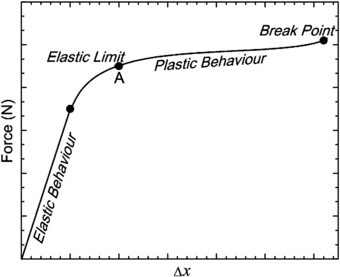
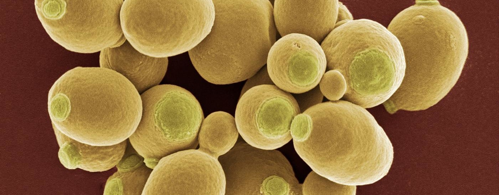
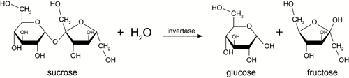
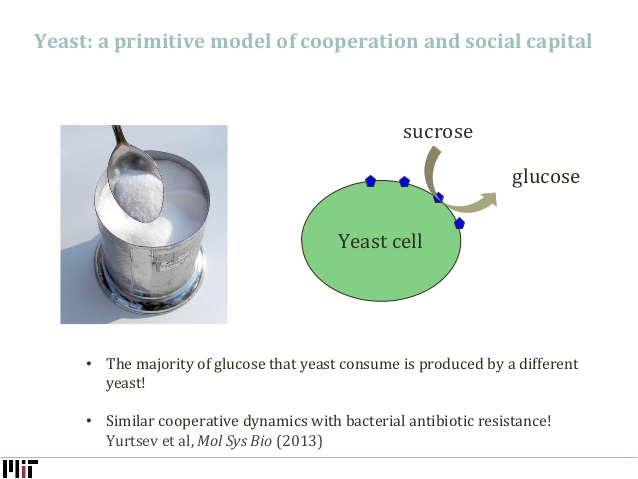
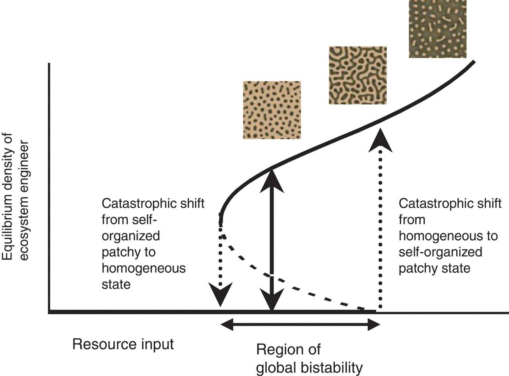
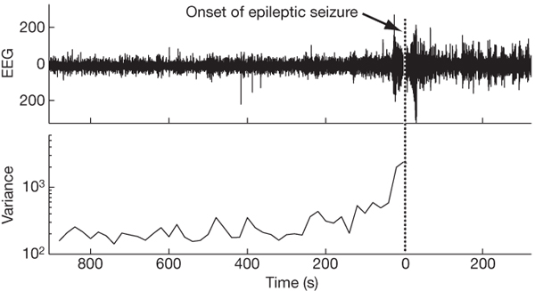
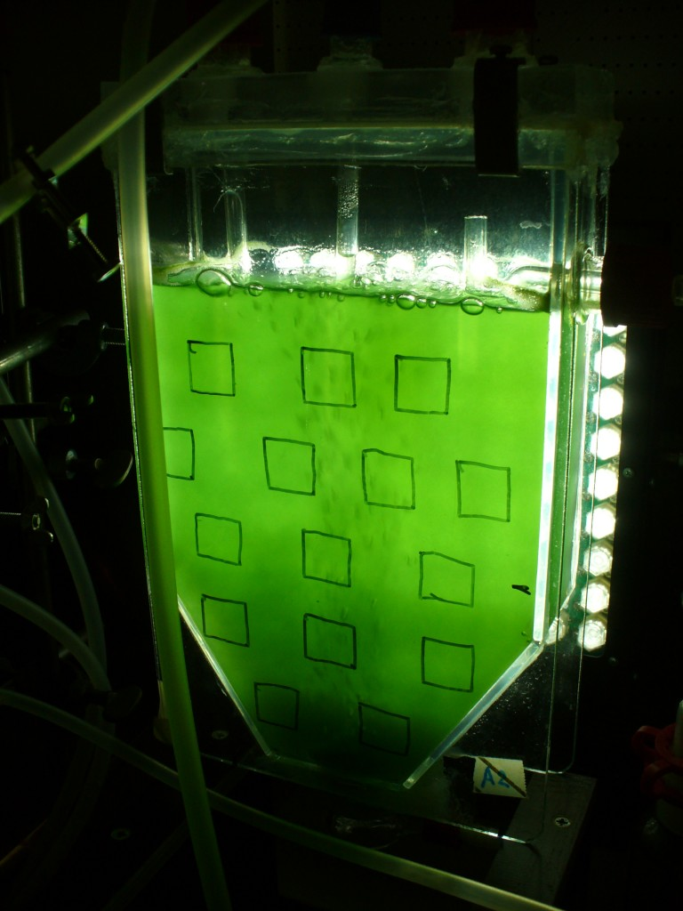
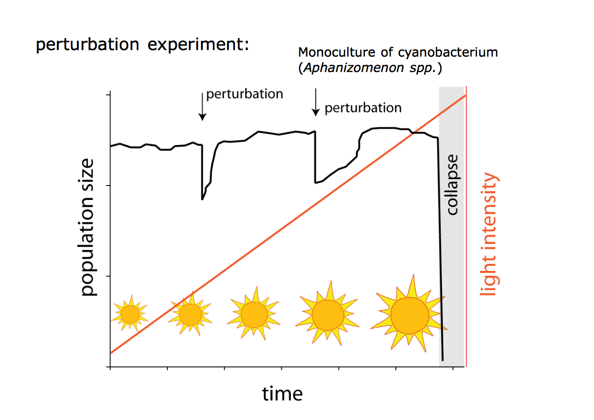
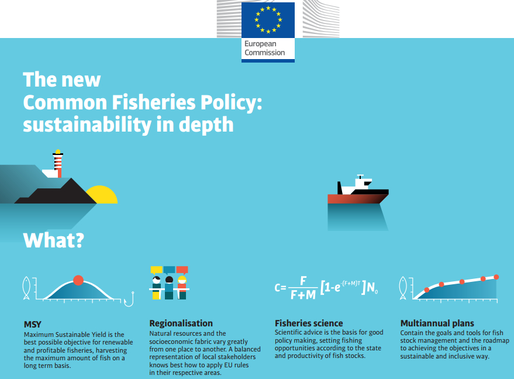

## Can ecological systems experience abrupt, catastrophic shifts?

<div class="centered">
**Many aquarium keepers [...] are unable to resist the temptation of slipping just one more fish into the container [...] And just this one more fish may be the final straw that breaks the camel's back. With too many animals in the aquarium, a lack of oxygen ensues. Sooner or later some organism will succumb to this and its death may easily pass unnoticed. The decomposing corpse causes an enormous multiplication of bacteria in the aquarium, the water becomes turbid, the oxygen content decreases rapidly, then further animals die and, through this vicious circle, the whole of our carefully tended little world is doomed. [...] what some days ago was a beautiful, clear pool with healthy growing plants and lively animals becomes a horrid, stinking brew.**

*King Solomon's Ring (1949) by Konrad Lorenz*
</div>

## Analogy: watershed map

<div class="centered">

</div>

## Analogy: rubber band

<div class="centered">

</div>

## Analogy: rubber band

<div class="centered">

</div>

**Triana and Fajardo, European Journal of Physics, 2012**

## Bistability

A dynamical system is **bistable** if it has **two equilibrium states**. 

Bistability is a special case of systems with multiple **alternative stable states**.

<div class="centered">

</div>

*By Georg Wiora, CC BY-SA 3.0, commons.wikimedia.org/w/index.php?curid=810601*

## Case study: shallow lakes $\mathcal \Pi$

<div class="centered">

</div>

*Scheffer, Conservation Ecology, 1999*

## Shallow lake food web

<div class="centered">

</div>

*Kuiper et al., Nature Communications, 2015*

## Important processes

<div class="centered">

</div>

*Scheffer, Conservation Ecology, 1999*

## Result: critical point

<div class="centered">

</div>

*Scheffer et al., Nature, 2001*

## Bifurcation

<div class="centered">

</div>

*Scheffer et al., Nature, 2001*

## Allee effect
Warder Clyde Allee (a professor at U of C) in the 1930s conducted a series of experiments to test whether goldfish grown in a tank containing silver suspension (toxic) would grow better in isolation, or in groups. Because each fish would absorb part of the toxic compounds, fish grown in tanks with other conspecifics would live longer than isolated fishes. 

The idea that populations could grow faster when in groups than in isolation came to be known as the *Allee effect* in the 1950s. Possible processed leading to an Allee effect are:

- finding a mate can be hard when the population is at low abundance.
- social cooperation could help escaping predators.
- social hunting could be beneficial.
- inbreeding depression.
- demographic stochasticity.

## A simple model with Allee effect
We can write a simple model for the (strong) Allee effect by modifying that for the logistic growth:

$\dfrac{dN}{dt} = r N \left( \dfrac{N}{A} - 1 \right) \left( 1 - \dfrac{N}{K} \right)$

Where $A < K$ is the **critical population size**: if $N > A$, then the population grows; if $N < A$, on the other hand, the population decreases.

## Model behavior $\mathcal \chi$
```{r echo = FALSE}
fluidRow(
  column(3,
  numericInput('x0', 'Initial density N(0)', 2.5,
                 min = 0, max = 100)),
  column(3,
       numericInput('r', 'Intrinsic growth r', 0.15,
                 min = 0, max = 100)),
  column(3,
      numericInput('K', 'Carrying capacity K', 8,
                 min = 0, max = 100)),
  column(3,
      numericInput('A', 'Critical size A', 2,
                 min = 0, max = 100))
)
```
```{r echo = FALSE}
library(deSolve)
library(reshape2)
renderPlot(height = 400, {
    allee_growth <- function(time, state, params){
    with(as.list(c(state, params)), {
      dXdt <- r * X  * (1 - X / K) * (X / A - 1)
      return(list(c(dXdt)))
      })
    }
    pars <- c(r = input$r, K = input$K, A = input$A)
    xini <- c(X = input$x0)
    times <- seq(0, 100, by = 0.05)
    out <- as.data.frame(ode(xini, times, allee_growth, pars))
    m <- melt(out, id.vars = "time")
    pl_logistic <- ggplot(m, aes(x = time, y = value, colour = variable)) + 
      geom_line(size = 2, alpha = 0.7) + 
      scale_x_continuous("Time t") + 
      scale_y_continuous("N(t)", limits = c(0, NA)) +
      geom_hline(yintercept = input$K, linetype = 2, colour = "black") + 
      theme_bw() + 
      theme(axis.text=element_text(size=14, face="bold"), axis.title=element_text(size=14, face="bold")) +
      theme(legend.position = "none")
    show(pl_logistic)
})
```

## Equilibria and Stability
```{r echo = FALSE}
fluidRow(
  column(3,
       numericInput('r2', 'Intrinsic growth r', 0.15,
                 min = 0, max = 100)),
  column(3,
      numericInput('K2', 'Carrying capacity K', 8,
                 min = 0, max = 100)),
  column(3,
      numericInput('A2', 'Critical size A', 2,
                 min = 0, max = 100))
)
```
```{r echo = FALSE}
renderPlot(height = 375, {
  Xs <- seq(0, 1.15 * input$K2, length.out = 100)
  growth_rate_allee <- data.frame(X = Xs, dXdt = input$r2 * Xs * (1 - Xs / input$K2) * (Xs / input$A2 - 1))
  eq_allee <- ggplot(growth_rate_allee, 
                        aes(x = X, y = dXdt)) + 
      geom_line(size = 2, alpha = 0.5, colour = "black") +
      scale_x_continuous("N(t)") + 
      scale_y_continuous("dN(t)/dt") +
      geom_point(x = 0, y = 0, shape = 16, size = 4, colour = "darkgreen") +
      geom_point(x = input$K2, y = 0, shape = 16, size = 4, colour = "darkgreen") +
      geom_point(x = input$A2, y = 0, shape = 16, size = 4, colour = "darkred") +
      geom_hline(yintercept = 0) + 
      geom_vline(xintercept = 0) + 
      theme_bw() + 
      theme(axis.text = element_text(size = 14, face = "bold"), axis.title = element_text(size=14, face="bold")) +
      theme(legend.position = "none")
    show(eq_allee)
})
```

## Allee effect in a bottle and tipping points
A dynamical system with the Allee effect can experience **abrupt, catastrophic shifts** in which the population, having **crossed the critical size, rapidly collapses**. 

Critical transition (catastrophic bifurcation): **small changes** in conditions **trigger extreme, discontinuous responses** that might be difficult to reverse.

There is a growing interest in documenting such **critical transition**, and finding **indicators** of the approaching of such critical points.

## Brewer's yeast
*Saccharomyces cerevisiae* ("sugar-mold of the beer") is a common yeast used for baking and brewing. It has been intensively studied as a model organism.

<div class="centered">

</div>

Yeast cannot directly metabolize sucrose (table sugar). To use sucrose as an energy source, it must first convert it to the monosaccharides (simple sugars) glucose and fructose.

## Sucrose is split outside the cells
<div class="centered">

</div>

Invertase is an enzyme that catalyzes the hydrolysis of sucrose. 

In yeast, invertase is released outside the cell, so that sucrose is split into fructose and glucose, which are then carried inside the cell.

However, the process is far from efficient: when yeast cells are isolated, the cost of producing the enzyme is higher than the benefit produced, as most of the monosaccharides produced are lost.

## Sucrose is split outside the cells
However, at high density yeast can be "cooperative": each cell produces the enzyme, and absorbs the monosaccharides produced by the pool, rather than their own. 

**This mechanism produces an Allee effect: at low densities, growth rate is negative, at high-densities, it is positive.**

## Sucrose is split outside the cells

<div class="centered">
David Healey
</div>

## Dai *et al.* Science 2012, Setup $\mathcal \Pi$
Dai and colleagues grew *S. cerevisiae* in monoculture using sucrose. 

They artificially imposed a **mortality** through daily dilutions.

They **started at different initial densities** and used a variety of dilution/mortality rates.

## Dai *et al.* Science 2012, Setup
This can be modeled as:

$\dfrac{dN}{dt} = r N \left( \dfrac{N}{A} - 1 \right) \left( 1 - \dfrac{N}{K} \right) - mN$ 

Three equilibria:

$N^* = 0$

$N^* = \frac{1}{2} \left(-\sqrt{(A-K)^2-\dfrac{4 A K m}{r}}+A+K\right)$

$N^* = \frac{\sqrt{r \left(r (A-K)^2-4 A K m\right)}+r (A+ K)}{2 r}$

## Equilibria and stability
```{r echo = FALSE}
fluidRow(
  column(3,
       numericInput('r3', 'Intrinsic growth r', 0.25,
                 min = 0, max = 100)),
  column(3,
      numericInput('K3', 'Carrying capacity K', 8,
                 min = 0, max = 100)),
  column(3,
      numericInput('A3', 'Critical size A', 2,
                 min = 0, max = 100)),
  column(3,
      numericInput('m3', 'Mortality m', 0.1,
                 min = 0, max = 1))
)
```
```{r echo = FALSE}
renderPlot(height = 375, {
  Xs <- seq(0, 1.15 * input$K3, length.out = 100)
  growth_rate_allee <- data.frame(X = Xs, dXdt = input$r3 * Xs * (1 - Xs / input$K3) * (Xs / input$A3 - 1) - input$m3 * Xs)
  eq_allee <- ggplot(growth_rate_allee, 
                        aes(x = X, y = dXdt)) + 
      geom_line(size = 2, alpha = 0.5, colour = "black") +
      scale_x_continuous("N(t)") + 
      scale_y_continuous("dN(t)/dt") +
      geom_point(x = 0, y = 0, shape = 16, size = 4, colour = "darkgreen") +
      geom_point(x = (sqrt(input$r3 * (input$r3 * (input$A3-input$K3)^2 - 4 * input$A3 *  input$K3 *  input$m3) ) + 
                        input$r3 * (input$A3 + input$K3)) / (2 *input$r3)
                   , y = 0, shape = 16, size = 4, colour = "darkgreen") +
      geom_point(x = 0.5 * (-sqrt((input$A3 - input$K3)^2 -(4 * input$A3 * input$K3 * input$m3)/(input$r3)) + 
                              input$A3 + input$K3)
                   , y = 0, shape = 16, size = 4, colour = "darkred") +
      geom_hline(yintercept = 0) + 
      geom_vline(xintercept = 0) + 
      theme_bw() + 
      theme(axis.text = element_text(size = 14, face = "bold"), axis.title = element_text(size=14, face="bold")) +
      theme(legend.position = "none")
    show(eq_allee)
})
```

## Dai et al. Science 2012, Results $\mathcal \Delta$
```{r echo = FALSE, message=FALSE, warning=FALSE}
library(dplyr)
library(ggplot2)
library(tidyr)
dai_data <- read.csv("./data/DaiEtAl_Science2012_data.csv", sep = " ")

pl_bifurc <- ggplot(dai_data %>% filter(dilution == 250 | dilution == 750 | dilution == 1266 | dilution == 1400), 
             aes(x = day, y = value, colour=extinction, group = paste(initial_density, replicate))) + 
  geom_line() + 
  facet_wrap(~dilution) + 
  scale_y_sqrt() + 
  scale_color_manual(values = c("#045a8d", "#b30000")) + 
  theme_bw() + theme(legend.position = "none")
show(pl_bifurc)
```

## Growth rates
```{r echo = FALSE, message=FALSE, warning=FALSE}
library(dplyr)
library(ggplot2)
library(tidyr)
dai_data <- read.csv("./data/DaiEtAl_Science2012_data.csv", sep = " ")

data_growth <- dai_data %>% group_by(dilution, replicate, initial_density) %>% arrange(dilution, replicate, day) %>% mutate(y =  lead(value) / value) %>% ungroup()

pl_growth <- ggplot(data = data_growth %>% filter(dilution == 250 | dilution == 750 | dilution == 1266 | dilution == 1400), 
                   aes(x = value, y = y, colour = y > 1)) + 
  geom_point() +
  facet_wrap(~dilution) + 
  scale_x_log10(expression(N[t])) + 
  scale_y_log10(expression(N[t+1]/N[t])) + 
  coord_cartesian(ylim = c(0.1, 15), xlim = c(0.01, 2)) + 
  scale_color_manual(values = c( "#b30000", "#045a8d")) + 
  theme_bw() + theme(legend.position = "none") + 
  geom_hline(yintercept = 1) 

show(pl_growth)
```

## Expecting the unexpected

System with Allee effect or similar mechanisms **can experience abrupt, catastrophic regime shifts**.

**Many natural and man-made systems** experience similar phenomena.

There is a growing interest in developing **measures that can anticipate the approaching of such transitions**.

## Climate
<div class="centered">


Lenton et al., PNAS 2007
</div>

## Climate
<div class="centered">


Scheffer et al., Nature 2009
</div>

## Vegetation in arid regions
<div class="centered">


Rietkerk et al., Science 2004
</div>

## Vegetation in arid regions
<div class="centered">


Rietkerk et al., Science 2004
</div>

## Epileptic seizures
<div class="centered">


Scheffer et al., Nature 2009
</div>

## Anticipating transitions: critical slowing down
Take the model:

$\dfrac{dN}{dt} = r N \left( \dfrac{N}{A} - 1 \right) \left( 1 - \dfrac{N}{K} \right)$

When $N$ is close to $A$, we have that $\dfrac{N}{A} - 1$ is close to zero: the growth/decrease of the population will be **slow**. 

Suppose that by altering the environmental conditions, we are increasing $A$ --- then we will see that the response to perturbations will **slow down**. 

Once we enter the basin of attraction of the zero equilibrium, the population will start collapsing.

## Slowing down at play: cyanobacteria
*Aphanizomenon flos-aquae* is a photosynthetic bacterium, commonly found in brackish waters. The bacteria form large surface aggregations (blooms), typically triggered by eutrophication. Most varieties are toxic.

<div class="centered">

</div>

## Photoinhibition

Light is necessary for photosynthesis, but interestingly **light** (especially UV) also **damages the molecular machinery responsible for photosynthesis**. Hence, plants and photosynthetic bacteria are **most productive at intermediate levels of light**.

Cyanobacteria provide shading for each other. As such, we expect that when we go from darkness to increased light conditions, the population will grow. However, once we reach a critical point, **we will observe the sudden collapse of photosynthetic activity**.

## Photoinhibition
<div class="centered">
 goo.gl/mfAHku
</div>

## Veraart *et al.*, Nature 2012 - Setup $\mathcal \Pi$
<div class="centered">
 goo.gl/mfAHku
</div>

## Veraart et al., Nature 2012 - Perturbations
<div class="centered">
 goo.gl/mfAHku
</div>


## Photoinhibition - Results
<div class="centered">
 goo.gl/mfAHku
</div>

## Fisheries
The Earth is largely covered by waters: we have $149 \cdot 10^6$ square km of land versus $361 \cdot 10^6$ of waters.

Marine habitats are great contributors to the total primary productivity of the biosphere.

Gross primary production (GPP) is the amount of chemical energy as biomass that primary producers create in a given length of time.

The GPP for terrestrial environments is 115B tons per year; that of marine environments is 55B per year.

Most of the productivity of the ocean is not directly accessible to humans (we do not eat bacteria or phytoplankton). It is however possible to access part of this energy through fisheries.

## Fisheries
- 85% of the fish caught is used for human consumption.

- Fish provide about 20% of the proteins consumed by the ~3B humans living in coastal areas. It makes 15% of the proteins for the remaining 4B.

- Since the end of WWI, fisheries have been growing at an alarming rate. This has resulted in the loss of predatory fish: the abundance of cod, swordfish and tuna has declined of 90% in the last 50 years.

## Critical transitions in fisheries $\mathcal \Delta$
```{r echo = FALSE, message=FALSE, warning=FALSE }
require(ggplot2)
require(dplyr)
cod_data <- read.csv("./data/cod_newfoundland-NAFO.csv")
pl_cod <- ggplot(data = cod_data %>% filter(Division == "2J" | Division == "3PS" | Division == "3K" | Division == "4R"),
                 aes(x = Year, y = Catch, colour = Division)) + geom_line(size = 2, alpha = 0.8) + theme_bw() + 
  theme(axis.text = element_text(size = 14, face = "bold"), axis.title = element_text(size=14, face="bold")) +
      theme(legend.position = "none") + ggtitle("Cod in Newfoundland (Tons)")
show(pl_cod)
```

## Anchovies vs. Sardines
<div class="centered">
 

Lluch-Cota, PNAS 2013
</div>

## Maximum Sustainable Yield
**Idea:** maximum yield (landings) that can be sustained indefinitely. 

From an economic standpoint, we want to get as much fish as possible. 

On the other hand, we want also to be able to fish in the future!

How much can we fish, before irremediably depleting the pool?

## MSY - Derivation

$\dfrac{d X(t)}{d t} = r X(t) \left(1  - \dfrac{X(t)}{K} \right) - H$

$H \geq 0$ Harvesting

Equilibria:

$X^* = 0$,

$r X^* \left(1  - \dfrac{X^*}{K} \right) = H$

$X^* = \dfrac{K}{2} \pm \dfrac{\sqrt{K^2 - \frac{4  H K}{r} }}{2}$ for $r \geq \dfrac{4 H K}{r}$

## When is $H$ maximized?

$H$ is maximal when $r X(t) \left(1  - \dfrac{X(t)}{K} \right)$ is maximized. 

Take derivative with respect to $X$:

$\dfrac{\partial}{\partial X} r X - \dfrac{r X^2}{K} = r - \dfrac{2 r X}{K}$

Set to zero and solve for $X$:

$r - \dfrac{2 r X}{K} = 0$; $\;\;X = \dfrac{K}{2}$

## When is $H$ maximized?

$\dfrac{d X(t)}{d t} = r X(t) \left(1  - \dfrac{X(t)}{K} \right) - H$

Keep the population at half of the carrying capacity, and you can harvest:

$H_{\text{max}} = \dfrac{r K}{4}$

## History

Initially developed in the 1930s, it started picking up momentum after WWII. 

It was rapidly adopted by several international organizations, as well as individual countries.

In the late 1970s, scientists began writing strong critiques of the concept.

But, as Walters and Maguire (1996) put it *"Even if scientists had suddenly reversed their conclusions and had called loudly and publicly for harvest restraints, by about 1982 an institutional juggernaut had been set in motion that no political decision maker would have dared try to stop until it was too late. The window of opportunity had closed."*

Despite the collapse of many fisheries in the 1990s, MSY is still listed as a goal in many international treaties.

## MSY -- European Commission, 2012
<div class="centered">
 

</div>


## MSY Leading to critical transition?
```{r echo = FALSE}
fluidRow(
  column(3,
       numericInput('r4', 'Intrinsic growth r', 0.25,
                 min = 0, max = 2, step = 0.05)),
  column(3,
      numericInput('K4', 'Carrying capacity K', 1000,
                 min = 0, max = 10000, step = 100)),
  column(3,
      numericInput('A4', 'Critical size A', 150,
                 min = 0, max = 10000, step = 50)),
  column(3,
      numericInput('H', 'Harverst', 10,
                 min = 0, max = 10000, step = 10))
)
renderPlot(height = 375, {
  Xs <- seq(0, 1.15 * input$K4, length.out = 100)
  growth_rate_msy <- data.frame(X = Xs, dXdt = input$r4 * Xs * (1 - Xs / input$K4) * (Xs / input$A4 - 1) - input$H)
  eq_msy <- ggplot(growth_rate_msy, 
                        aes(x = X, y = dXdt)) + 
      geom_line(size = 2, alpha = 0.5, colour = "black") +
      scale_x_continuous("N(t)") + 
      scale_y_continuous("dN(t)/dt") +
      geom_hline(yintercept = 0) + 
      geom_vline(xintercept = 0) + 
      theme_bw() + 
      theme(axis.text = element_text(size = 14, face = "bold"), axis.title = element_text(size=14, face="bold")) +
      theme(legend.position = "none")
    show(eq_msy)
})
```

## Other problems with MSY
- Single species.

- No population structure.

- Parameters $r$ and $K$ are not easy to measure in practice.

- Populations are (naturally) fluctuating, a constant harvest leads to depletion.

## MSY Epitaph (Larkin, 1977)
<div class="centered">
**M. S. Y. 1930s-1970s** 

Here lies the concept, MSY. 

It advocated yields too high, 

And didn't spell out how to slice the pie. 

We bury it  with the best of wishes, 

Especially on behalf of fishes. 

We don't know yet what will take its place, 

But hope it's as good for the human race.

R.I.P.
</div>

## Conclusions
- Dynamical systems can have **different attractors**.
- Stochastic fluctuations can **move the system between states**.
- **Allee effect** is sufficient to create bi-stable systems.
- Bistable systems can be re-created in the laboratory, and the approaching of a critical transition can be measured.
- In natural systems, we observe similar dynamics. 
- This is especially worrisome in the case of fisheries---many cases of collapse in the past 20 years.
- We need more holistic approaches for determining what can be harvested.
