## Can a pandemic wipe out the human race?

**Pile upon pile the throng of their own dead:**
**And weary with woe and weeping wandered home;**
**And then the most would take to bed from grief.**
**Nor could be found not one, whom nor disease**
**Nor death, nor woe had not in those dread times**
**Attacked.** *De Rerum Natura (around 50 BCE) by Lucretius*

**It was the peculiar and dreadful distinction of our visitation, that none who had been attacked by the pestilence had recovered. The first symptom of the disease was the death-warrant, which in no single instance had been followed by pardon or reprieve. ** *The Last Man (1826) by Mary Shelley*

**the astonishing quickness with which this germ destroyed human beings, and [by] the fact that it inevitably killed any human body it entered. [...] From the moment of the first signs of it, a man would be dead in an hour. Some lasted for several hours. Many died within ten or fifteen minutes of the appearance of the first signs.** *The Scarlet Plague (1915) by Jack London*

## Deadly pandemics
-*Plague of Justinian* (541-542 CE) **Bubonic plague** -- ca. 40% of the population of Europe

-*Black Death* (1346-1350)  **Plague** -- up to 70% of the population of Europe

-*Cocoliztli* (1545-1548) **Viral hemorragic fever** -- 80% of the population of Mexico

-*Spanish flu* (1918-1920) **Influenza** -- 75M deaths around the world

-*AIDS* (1960-today) **HIV/AIDS** -- More than 30M victims

-*No name* (today) **Yellow fever** -- hundreds of victims in Angola

-*Swine flu* (today) **Influenza A, H1N1** -- >2000 victims in India

-*Zika* (today) **Zika virus** -- hundreds of cases

## Infectious disease
Illness resulting from the presence of pathogenic microbial agent:

- **Virus** (e.g., HIV/AIDS, chickenpox, Herpes, Human Papilloma Virus, Ebola)

- **Bacteria** (e.g., tubercolosis, *Legionella*)

- **Fungi** (e.g., *Candida*)

- **Protozoa, helminths, trematodes** (e.g., malaria, caused by the protozoan *Plasmodium*; Scistosomiasis, caused by the trematode *Schistosoma*)

- **Prions** (e.g., mad cow disease)

*Communicable* diseases can be spread from person to person. Some diseases are *infectious* but not *communicable* (e.g., tetanus).

## Mode of transmission
- **Person-to-person**: either direct (e.g., STDs) or indirect contact (e.g., exchange of blood or other bodily fluids).
- **Airborne**: ihalation of infected air (e.g., influenza, chickenpox, measles, tubercolosis).
- **Vector-borne**: transmitted by a vector (e.g., mosquito, tick, snail). West Nile virus, malaria, dengue, Zika are all vector-borne.
- **Food-borne** and **water-borne**: ingestion of contaminated food or water. E.g., salmonella, cholera.
- **Vertical**: from mother to child before birth (e.g., hepatitis B, herpes simplex).

## Famous victims
- **Cholera** (*Vibrio cholera*, bacterium): Charlex X, king of France;  Friedrich Hegel; Carl von Clausewitz; Sadi Carnot (thermodynamics); Pyotr Ilyich Tchaikovsky (disputed)

- **Malaria** (protozoa of the genus *Plasmodium*): Raffaello Sanzio; Caravaggio (?); George Byron; Amerigo Vespucci

- **Tuberculosis** (*Mycobacterium tuberculosis*, bacterium): Tutankhamen; Baruch Spinoza; Simon Bolivar; Elizabeth Barrett Browning; Edgar Allan Poe; Frederic Chopin; Emily Bronte; Eleanor Roosevelt; George Orwell

- **Syphilis** (*Treponema pallidum*, bacterium) Henri de Toulouse-Lautrec; Paul Gaugin; Edouard Manet; Oscar Wilde; Guy de Maupassant; Charles Baudelaire; Al Capone

## Modeling infectious diseases
In 1926 Anderson Gray McKendrick published *Applications of mathematics to medical problems*, which contained a continuous-time dynamical model that serves as the jumping board for many models produced today. 

In 1927 McKendrick and William Ogilvy Kermack published *Contributions to the mathematical theory of epidemics*, where they studied the famed S-I-R model.

Main concepts:

- $N$ individuals (constant --- no births/immigration).

- Each individual is in one of three states: $S$, susceptible; $I$, infected; $R$, recovered.

- Susceptibles can become Infected; Infected can Recover.

## Contacts
$N$ is the number of people in the population. 

$c N$ is the number of contacts one individual makes per unit-time. We assume that the population is well-mixed (i.e., every person has the same contact rate). 

$S(t) / N$ is the probability that a contact involves a susceptible individual.

Therefore, $c N S(t) / N = c S(t)$ is the number of contacts between an individual and susceptibles individuals per unit time.

If each contact leads to the transmission of the disease with probability $p$, then $p c S(t)$ is the number of susceptibles that an infected individual infects per unit time. 

## Contacts
If there are $I(t)$ infected and $S(t)$ susceptibles, $p c S(t) I(t) = \beta S(t) I(t)$ is the number of individuals that are infected per unit time.

Therefore:

$\dfrac{d S(t)}{d t} = - \beta S(t) I(t)$

Units:

$\dfrac{d S(t)}{d t}$ individuals / time

$\beta$ 1/(time * individuals)

$S(t)$, $I(t)$ individuals

## Susceptible-Infected
Suppose one cannot recover from the disease, and that the disease does not really change the mortality of individuals. The most fitting example is not the spread of an actual disease, but of rumors or other information.
We have only two equations. 

$\begin{cases}
\dfrac{d S(t)}{d t} = - \beta S(t) I(t)\\
\dfrac{d I(t)}{d t} = \beta S(t) I(t)
\end{cases}$

But because we keep the population fixed, $N = S(t) + I(t)$, we really have only one equation:

$\dfrac{d I(t)}{d t} = \beta S(t) I(t) = \beta (N - I(t)) I(t) = \beta N I(t) \left(1 - \dfrac{I(t)}{N}\right)$ 

## Susceptible-Infected
$\dfrac{d I(t)}{d t} = \beta S(t) I(t) = \beta (N - I(t)) I(t) = \beta N I(t) \left(1 - \dfrac{I(t)}{N}\right)$ 

which should remind you of something....

$\dfrac{d X(t)}{d t} = r X(t) (1 - X(t) / K)$

Then, for any positive initial number of infected, $I(0)$, the whole population is infected in the end, as long as $\beta N > 0$. 

## Models $\mathcal \chi \mathcal \Pi$
```{r echo = FALSE, warning=FALSE, message=FALSE}
fluidRow(
  column(3,
  selectInput(inputId = "model",
                label = "Model:",
                choices = c("S-I"      = "si",
                            "S-I-S"    = "sis",
                            "S-I-R"    = "sir"),
                selected = "si")),
  column(3,
    numericInput('i_t0', 'I(0)', 0.01,
                 min = 0, max = 1.0, step = 0.05)),
    
    column(3,
           numericInput('beta', 'Contact rate', 0.1,
                 min = 0, max = 1000.0, step = 0.1)),
    
    uiOutput("gamma")
    )
```
```{r echo = FALSE, warning=FALSE, message=FALSE}
library(deSolve)
library(ggplot2)
library(ggthemes)
library(gridExtra)
library(reshape2)
de_si <- function(time, state, params){
  with(as.list(c(state, params)), {
    dSdt <- -beta * S * I
    dIdt <- beta * S * I
    return(list(c(dSdt, dIdt)))
  })
}

de_sis <- function(time, state, params){
  with(as.list(c(state, params)), {
    dSdt <- -beta * S * I + gamma * I
    dIdt <- beta * S * I - gamma * I
    return(list(c(dSdt, dIdt)))
  })
}

de_sir <- function(time, state, params){
  with(as.list(c(state, params)), {
    dSdt <- -beta * S * I 
    dIdt <- beta * S * I - gamma * I
    dRdt <- gamma * I
    return(list(c(dSdt, dIdt, dRdt)))
  })
}

output$gamma = renderUI(
  {
    if (input$model %in% c("sis", "sir"))
    {
      column(3,
      numericInput('gamma', 'Recovery rate', 0.05,
                   min = 0, max = 1000.0, step = 0.01))
    }
  })
  renderPlot({ 
    if (input$model == "si"){
      pars <- c(beta = input$beta)
      yini <- c(S = 1.0 - input$i_t0, I = input$i_t0)
      times <- seq(0, 100, by = 0.05)
      out <- as.data.frame(ode(yini, times, de_si, pars))
      m <- melt(out, id.vars = "time")
      pl <- ggplot(m, aes(x = time, y = value, colour = variable)) + geom_line(size = 2)
      pl <- pl + theme_bw() + theme(axis.text = element_text(size = 14, face = "bold"), axis.title = element_text(size=14, face="bold"))
      show(pl)
    }
    if (input$model == "sis"){
      #shiny:::flushReact()
      pars <- c(beta = input$beta, gamma = input$gamma)
      yini <- c(S = 1.0 - input$i_t0, I = input$i_t0)
      times <- seq(0, 100, by = 0.05)
      out <- as.data.frame(ode(yini, times, de_sis, pars))
      m <- melt(out, id.vars = "time")
      pl <- ggplot(m, aes(x = time, y = value, colour = variable)) + geom_line(size = 2)
      pl <- pl + theme_bw() + theme(axis.text = element_text(size = 14, face = "bold"), axis.title = element_text(size=14, face="bold"))
      show(pl)
    }
    if (input$model == "sir"){
      pars <- c(beta = input$beta, gamma = input$gamma)
      yini <- c(S = 1.0 - input$i_t0, I = input$i_t0, R = 0.0)
      times <- seq(0, 100, by = 0.05)
      out <- as.data.frame(ode(yini, times, de_sir, pars))
      m <- melt(out, id.vars = "time")
      pl <- ggplot(m, aes(x = time, y = value, colour = variable)) + geom_line(size = 2)
      pl <- pl + theme_bw() + theme(axis.text = element_text(size = 14, face = "bold"), axis.title = element_text(size=14, face="bold"))
      show(pl)
    }
  })
```

## Recovery rate
Suppose that at time $0$, a certain number of individuals, $I(0)$ is infected, and that they are isolated from the rest of the population.  We call $\gamma$ the "recovery rate" of infected individuals, and write:

$\dfrac{d I(t)}{d t} = - \gamma I(t)$

This is an equation we know how to solve:

$I(t) = I(0) e^{-\gamma t}$ (exponential growth/decay). 

Then, $I(t) / I(0)$ is the proportion of individuals who are still infected at time $t$, and

$1 - \dfrac{I(t)}{I(0)} = 1 - e^{-\gamma t}$ 

is the probability of having recovered in the time interval $[0, t)$. 

## Recovery rate
Because this is a cumulative distribution function, taking derivatives we find the probability density function:

$\dfrac{\partial \left(1 - e^{-\gamma t}\right)}{\partial t} = \gamma e^{-\gamma t}$

Taking the expectation (average time spent infected):

$\int_0^\infty t (\gamma e^{-\gamma t}) dt = \dfrac{1}{\gamma}$

Which means that $\gamma$ is simply the inverse than the mean time spent in the infected class.
For example, influenza lasts about 5 days, meaning that $\gamma \approx 1/5$. 

## Recovery rate
We can therefore write:

$\dfrac{d I(t)}{d t} = \beta S(t) I(t) - \gamma I(t)$

## Susceptible-Infected-Susceptible
Now we can write a slightly more complex model, in which individuals go back to the susceptible class once they recover from the disease. This is the case of bacterial infections, or other infections that do not provide lifelong immunity.

$\begin{cases}
\dfrac{d S(t)}{d t} = -\beta S(t) I(t) + \gamma I(t)\\
\dfrac{d I(t)}{d t} = \beta S(t) I(t) - \gamma I(t)
\end{cases}$

Again, we really have only one equation, as $S(t) = N - I(t)$:

$\dfrac{d I(t)}{d t} = \beta I(t) (N - I(t)) - \gamma I(t)$

## Susceptible-Infected-Susceptible
$\dfrac{d I(t)}{d t} = \beta I(t) (N - I(t)) - \gamma I(t)$

$\beta I(t) (N - I(t)) - \gamma I(t) = \beta I(t) N - \gamma I(t) - \beta I(t)^2 =$

$(\beta N - \gamma)I(t) - \beta I(t)^2 = (\beta N - \gamma)I(t) \left(1 - \dfrac{I(t)}{N - \dfrac{\gamma}{\beta}}\right)$

...which is again a logistic growth! 

$I(\infty) = N - \frac{\gamma}{\beta}$

as long as $(\beta N - \gamma) > 0$

## Susceptible-Infected-Recovered
Finally, we can write the famous S-I-R model, which plays a major role in understanding viral diseases. Instead of making the recovered individuals susceptible again, we move them into a new class ($R$, recovered, or, in the case of deadly diseases, removed).

$\begin{cases}
\dfrac{d S(t)}{d t} = - \beta S(t) I(t)\\
\dfrac{d I(t)}{d t} = \beta S(t) I(t) - \gamma I(t)\\
\dfrac{d R(t)}{d t} =  \gamma I(t)
\end{cases}$


## Susceptible-Infected-Recovered

$N(t) = S(t) + R(t) + I(t)$. From the equations, we see that 

$\dfrac{d N(t)}{d t} = \dfrac{d S(t)}{d t} + \dfrac{d I(t)}{d t} + \dfrac{d R(t)}{d t} = 0$ --- we have constant population size.

## Susceptible-Infected-Recovered
$\begin{cases}
\dfrac{d S(t)}{d t} = - \beta S(t) I(t)\\
\dfrac{d I(t)}{d t} = \beta S(t) I(t) - \gamma I(t)\\
\dfrac{d R(t)}{d t} =  \gamma I(t)
\end{cases}$

- The number of susceptibles is always declining in time.

- The number of recovered is always increasing in time.

- The number of infected is increasing whenever $\beta S(t) > \gamma$. 

## Basic reproduction number
Suppose that at the beginning of the epidemic we have only a few infected individuals, and that no one has recovered yet. Then: $R(0) = 0$

Will we have an epidemic? We write:

$\dfrac{1}{I(t)}\dfrac{d I(t)}{d t} = \beta S(t) - \gamma$

Substituting $S(0) \approx N$, we have: $\dfrac{1}{I(0)}\dfrac{d I(0)}{d t} = \beta N - \gamma$.

Thus, the infection will spread whenever $\beta N - \gamma > 0$, which we write as:

$\dfrac{\beta N}{\gamma} = \mathscr R_0 > 1$

## Basic reproduction number
$\dfrac{\beta N}{\gamma} = \mathscr R_0 > 1$

$\mathscr R_0$ ("r-naught") is the **basic reproduction number**, and it expresses the number of infections generated by the first infected individual in a otherwise susceptible population.

## Values for preventable diseases
<div class="centered">
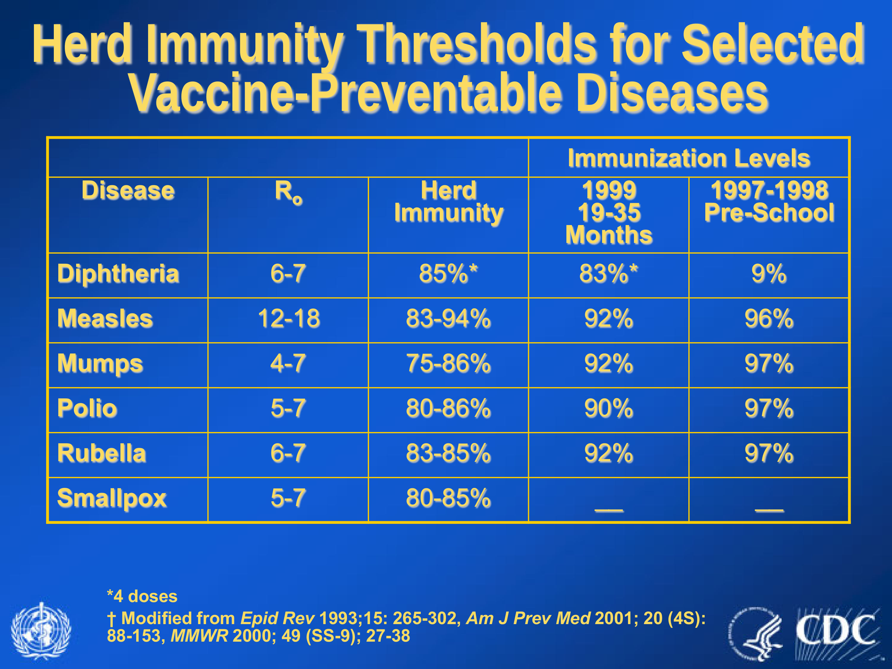
</div>

## Faustian Limerick (Robert M. May, 1982)

*The deeper understanding Faust sought,*

*Could not from the Devil be brought,*

*But now we are told,*

*By theorists bold,*

*All we need to know is* $\mathscr R_0$

## The end of the outbreak
We would like to find $S(\infty)$ and $R(\infty)$. We divide the equation for the growth of $S$ by that for the growth of $R$:

$\dfrac{d S(t)}{d R(t)} = -\dfrac{\beta}{\gamma} S(t)$

This is like the equation of the exponential growth. Solving:

$S(t) = S(0) e^{-\frac{\beta}{\gamma} R(t)}$, which is surely greater than $S(0) e^{-\frac{\beta}{\gamma} N}$. Hence, $S(t) > 0$ for all $t$.

## The end of the outbreak
$S(t) = S(0) e^{-\frac{\beta}{\gamma} R(t)}$, which is surely greater than $S(0) e^{-\frac{\beta}{\gamma} N}$. Hence, $S(t) > 0$ for all $t$.

This is very important: no matter the dynamics of the disease, a certain fraction of the susceptible population will be left untouched. The epidemic does not end because all individuals have been infected and have either died or recovered; rather, finding new susceptibles becomes more difficult, and at some point $\beta S(t) - \gamma < 0$, and the outbreak size starts decreasing.

## Fitting data
We want to fit the SIR model to real data.

If we know $N$, $S(0)$, $I(0)$ and $R(0)$, we need to fit two parameters: $\beta$, the contact rate, and $\gamma$, the recovery rate. 

The data we're going to fit is the number of infected individuals at time $t$, $I(t)$. 

For each choice of $\beta$ and $\gamma$, we obtain the predicted number of cases $I_{\text{pred}}(t)$, and we choose the parameters that minimize the sum of squares:

$SSQ = \sum_i (I(t) - I_{\text{pred}}(t))^2$

## English boarding school $\mathcal \Delta$
<div class="columns-2">
- In Jan and Feb 1978, an epidemic of H1N1 influenza struck a boarding school in England
- A boy returning from Hong Kong was sick on Jan 15-18
- On Jan 22, three boys were sick
- Eventually, only 19 out of 738 boys escaped the outbreak
- For each day, we have the number of boys who are infected
- We expect a $\gamma$ of about $1/2$, as after a few days the boys were bed-ridden, and thus could not spread the disease.

```{r kable, echo = FALSE}
library(knitr)
data_eng <- read.csv("./data/BoardingSchool.csv")  
kable(data_eng, pad = 0, format = "html")
```
</div>

## Model fit $\mathcal \chi$
```{r, echo=FALSE,message=FALSE,warning=FALSE}
library(ggplot2)
data_eng <- read.csv("./data/BoardingSchool.csv")
source("code/fit_SIR.R")
days <- data_eng[,1]
infected <- data_eng[,2]
N <- 763
initial.gamma <- 1/2
initial.beta <- 0.001
best_pars <- get_best_pars(initial.beta, initial.gamma, N, infected, days)
best_sol <- best_predict(best_pars$beta, best_pars$gamma, N, infected, days)
eng_df <- data.frame(day = days, observed = infected, predicted = best_sol)

pl_eng <- ggplot(data = eng_df,
             aes(x = day, y = observed))+ geom_point() + geom_line(aes(x = day, y = predicted)) + 
  theme_bw() + theme(axis.text = element_text(size = 14, face = "bold"), axis.title = element_text(size=14, face="bold")) + ylab("infected")
show(pl_eng)
```

## SIR for endemic diseases
The model we've seen deals with epidemics, which is the spread of the disease over a short period of time (hence, we could consider the population to be fixed). For endemic diseases (i.e., which are circulating and maintained within the population), we need to accound for births and deaths. For simplicity, say that the population is at equilibrium, such that the number of births is close to the number of deaths:

$\begin{cases}
\dfrac{d S(t)}{d t} = - \beta S(t) I(t) + \mu N - \mu S(t) \\
\dfrac{d I(t)}{d t} = \beta S(t) I(t) - \gamma I(t) - \mu I(t) \\
\dfrac{d R(t)}{d t} =  \gamma I(t) - \mu R(t)
\end{cases}$

Where $\mu N = \mu S + \mu I + \mu R$

## Derivation of $\mathscr R_0$

We have spread of the disease whenever

$\beta S(t) I(t) - \gamma I(t) - \mu I(t) > 0$

divde by $I(t)$, and set $S(t) = N$

$\beta N - \gamma - \mu > 0$

Hence:

$\mathscr R_0 = \dfrac{\beta N}{\gamma + \mu}$

again, if $\mathscr R_0 > 1$ the disease can spread.

## Equilibria

There are two equilibria:

- **Disease free** $S^* = N, I^*=0$

- **Endemic** $S^* = \dfrac{\gamma +\mu }{\beta }, I^* = \dfrac{\mu  N}{\gamma +\mu } - \frac{\mu }{\beta }, R^* = \dfrac{\gamma  N}{\gamma +\mu }-\dfrac{\gamma }{\beta}$

but $\mathscr R_0 = \dfrac{\beta N}{\mu + \gamma}$, then $S^* = N / \mathscr R_0$

Similarly, $I^* = \mu (\mathscr R_0 - 1)/\beta$, and $R^* = \gamma (\mathscr R_0 - 1)/\beta$

## Vaccination
Suppose that we vaccinate a proportion $p$ of all newborns. The equations become:

$\begin{cases}
\dfrac{d S(t)}{d t} = - \beta S(t) I(t) + \mu N (1-p) - \mu S(t) \\
\dfrac{d I(t)}{d t} = \beta S(t) I(t) - \gamma I(t) - \mu I(t) \\
\dfrac{d R(t)}{d t} =  \gamma I(t) - \mu R(t) + \mu N p
\end{cases}$

Then the disease-free equilibrium is $S^* = N (1-p)$, with $I^*=0$ and $R^*=0$

The disease cannot spread whenever $\beta N(1-p) - \gamma - \mu < 0$

## Critical vaccination
The disease cannot spread when $\beta N(1-p) - \gamma - \mu < 0$
which can be written as 

$(1-p) \mathscr R_0 < 1$

Then if we can vaccinate $p > 1 - \dfrac{1}{\mathscr R_0}$ of the newborns (or small children who haven't experienced the disease yet), we can eradicate the disease completely.

## Critical vaccination
Clearly, this is easier to do for diseases that are not highly contagious (small $\mathscr R_0$). 
If  $\mathscr R_0 \approx 5$ (polio, smallpox), we need to vaccinate $>80\%$ of the newborns. This is "easy" to do.

However, for very contagious diseases, with say $\mathscr R_0 \approx 15$ (measles), we need to vaccinate $>93\%$ of the newborns. The actual required proportion is actually higher, as no vaccine has 100% efficacy (e.g., for measles the first shot is effective in about 90% of cases; the efficacy increases with a second dose), and not everybody can be vaccinated (particular medical conditions, etc.) 

## Critical vaccination
If we achieve this **critical level of vaccination**, we have **herd immunity**: even the susceptibles will not be infected, as the disease cannot spread. 

## Cases of Measles in US and anti-vaccination
- Thanks to mass vaccination, measles was eliminated from the US in 2000. 
- However, measles is still diffused elsewhere in the world, and travelers can bring the infection into the country.
- Because many parents refuse to vaccinate their children, the number of cases is on the rise:
- 2010, 63 cases; 2011, 220; 2012, 55; 2013, 187; 2014, 667.
- In 2015, the first measles-related death since 2003. 
- Mass vaccination provides herd immunity for more fragile subjects (e.g. immunodepressed); falling below critical vaccination would lead to the resurgence of the disease. 

## A success story: Smallpox
- Caused by the virus *Variola major* and *Variola minor*.
- Found in India in 1500 BCE; the mummy of Ramses V shows that the pharaoh died of it in 1145 BCE.
- *Variola major* leads to 30% mortality; survivors can become blind or suffer deformities (up to 5% of cases).
<div class="centered">

</div>

## Smallpox and history
- Introduction into the new world facilitated Spanish conquest.
- 1694 Queen Mary II of England, aged 32, dies of smallpox.
- 1736 Benjamin Franklin's son dies of smallpox:

*In 1736 I lost one of my Sons, a fine Boy of 4 Years old, taken by the Small Pox in the common way. I long regretted that I had not given it to him by Inoculation, which I mention for the Sake of Parents, who omit that Operation on the Supposition that they should never forgive themselves if a Child died under it*

- In 1738, smallpox killed half the Cherokee Indian population.
- 1781, Andrew Jackson contracts the disease and survives; his brother is not as lucky.

## Vaccination
- Inoculation (variolation) started in China in the 10th century.
- Take scabs from infected patients, and inoculate in the skin of healthy patients.
- Care was taken in selecting patient who had contracted *Variola minor* (with much lower mortaility).
- A localized reaction would form, and the patient would gain immunity to both viruses.
- Variolation still led to a $\approx 1\%$ mortality!
- In 1796  Edward Jenner showed that immunity to smallpox could be produced by inoculating cowpox (a virus of the same family targeting cattle).
- Vaccine! (from *vacca*, cow in Latin).

## Eradication history
<div class="centered">
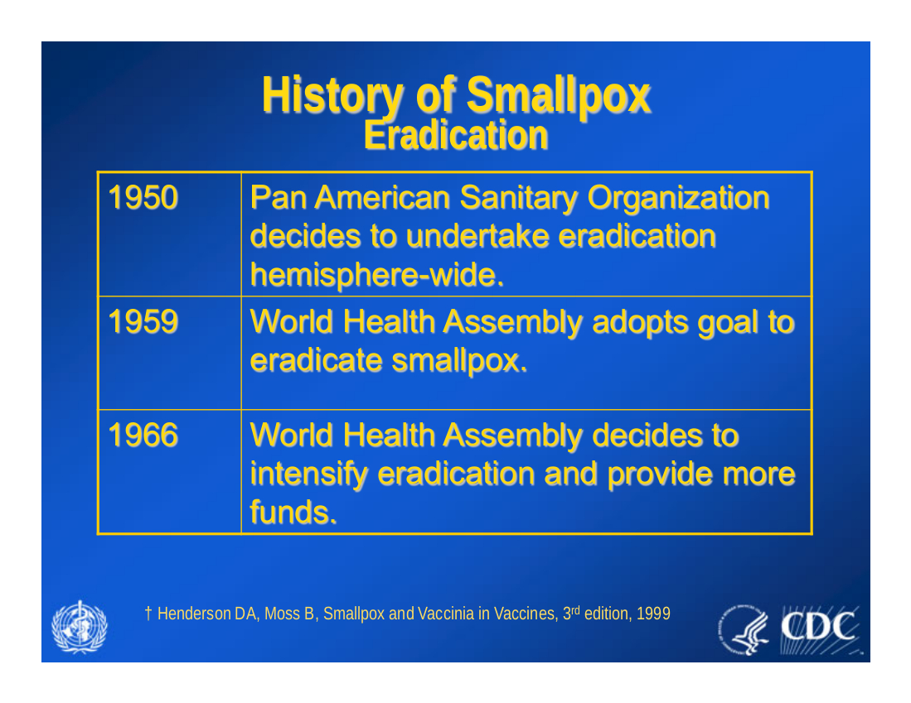
</div>


## Eradication strategy
<div class="centered">
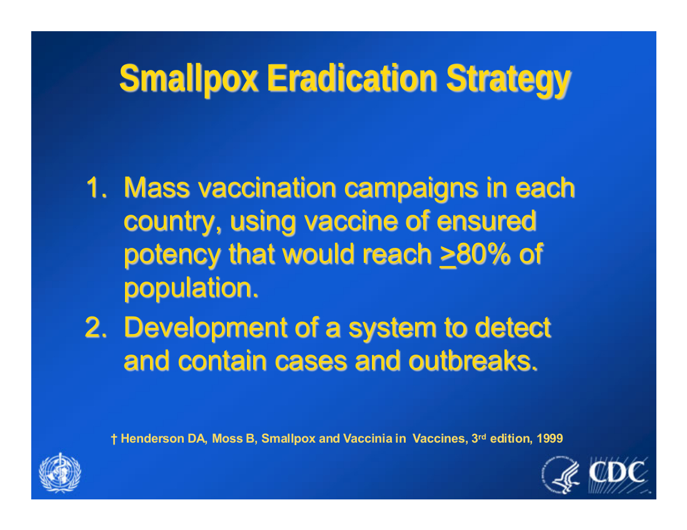
</div>

## Mass vaccination
<div class="centered">
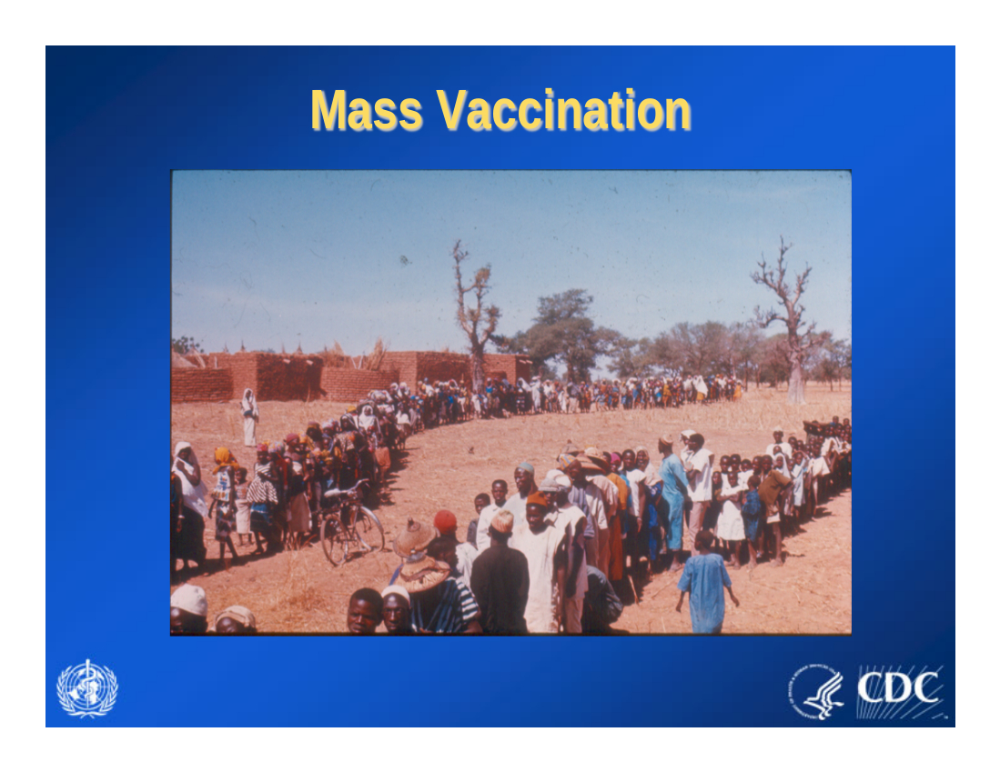
</div>

## Eradication
<div class="centered">
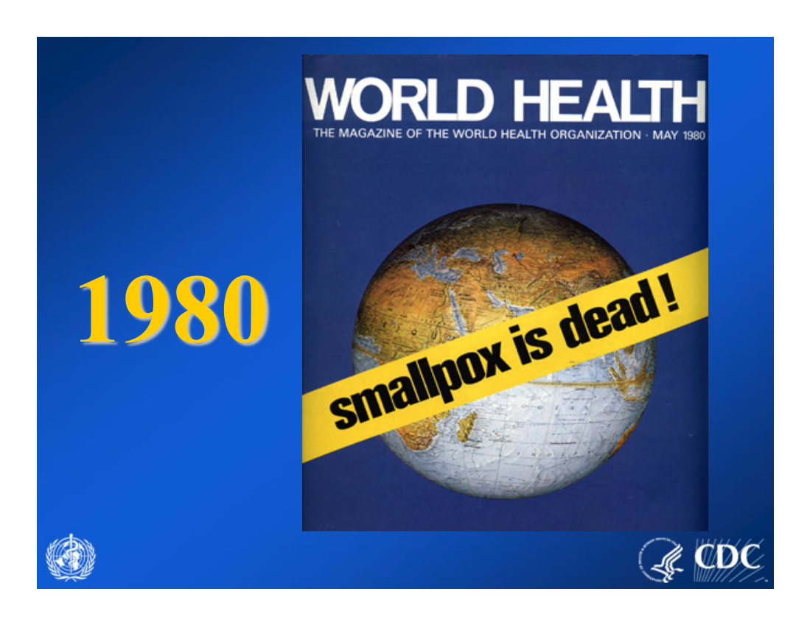
</div>

## Eradication?
In 1978, a medical photographer died of smallpox, which he had contracted at the U. Birmingham.
[Malcom Casadaban died of *Y. pestis* at UofC in 2011]


This led to the decision of destroying the stock smallpox used for research. However, being in the height of the cold war, both the US and the Soviet Union decided to retain some samples (which of course could be used for bacteriological warfare...). In the US, the **CDC** conserves smallpox samples, while in Russia these are conserved at the **State Research Center of Virology and Biotechnology VECTOR in Koltsovo** (straight out of a James Bond movie).

The distruction of these samples (which would not bee needed for producing vaccines, should the need arise), as caused much controversy. See the 2011 NYT Op Ed from US Secretary of Health (*"Destroying the virus now is merely a symbolic act that would slow our progress and could even stop it completely, leaving the world vulnerable"*).

## Exercise: 
Diphteria is an infection caused by the bacterium *Corynebacterium diphtheriae*. It is fatal in 5-10% of cases (much higher fatalities for small children and adults over forty). After the fall of the Soviet Union vaccination faltered, leading to a large increase in the number of cases. 

In the US, children are immunized through the pentavalent DTP-HepB-Hib vaccine (Diphteria; Tetanus; Pertussis; Hepatitis B, Haemophilus influenza type B).

The $\mathscr R_0$ is about 7. Calculate the what proportion of children should be vaccinated in order to achieve herd immunity, taking into account that the efficacy of the vaccine is about 97%.

## More Complex Models: Ebola
<div class="centered">
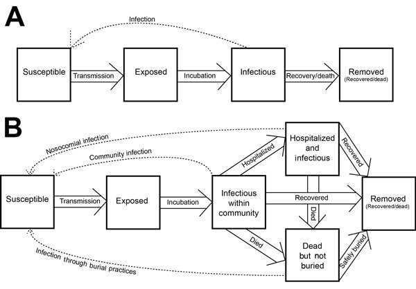

Drake et al., Emerg Infect Dis. 2015
</div>

## More Complex Models: Ebola
<div class="centered">
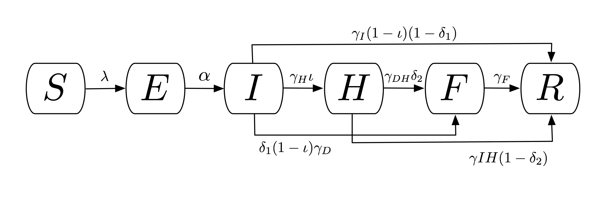

Rivers et al., PLoS Curr. 2014
</div>

## Malaria -- model evolution!
<div class="centered">
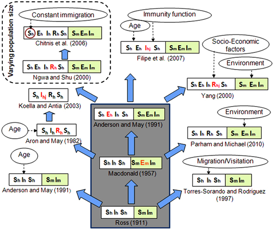

Silal et al., Health Systems 2015
</div>

## Pertussis: contact network
<div class="centered">
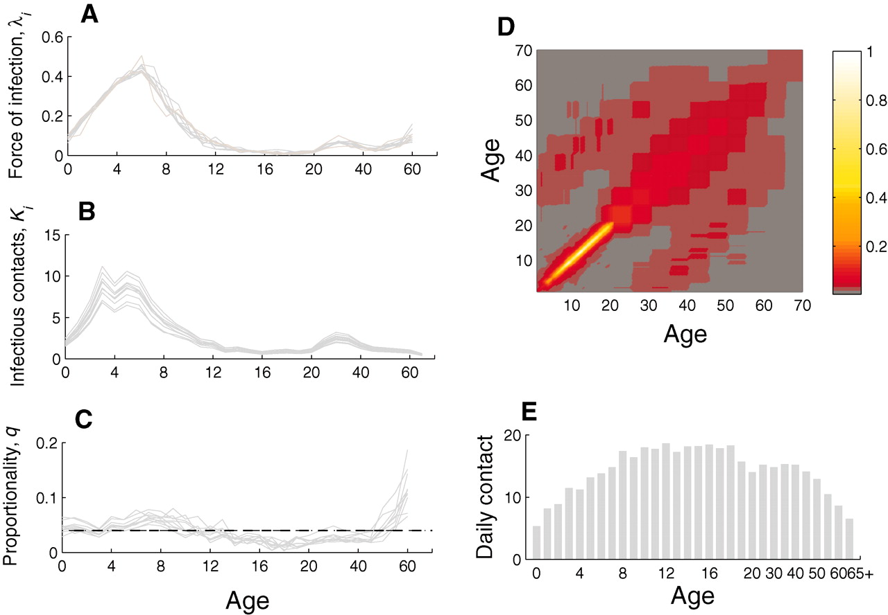

Rohani et al., Science 2010
</div>

## Foot and mouth -- spatial model
<div class="centered">


Keeling et al., Science 2001
</div>

## Zombie attack! $\mathcal \Pi$
<div class="centered">
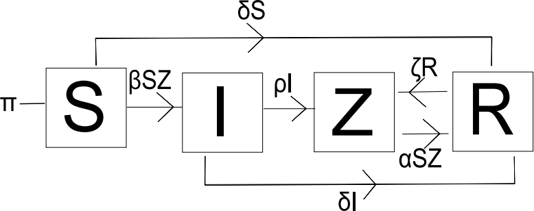
</div>

## Complex life cycles: *Plasmodium*
<div class="centered">

</div>

## Complex life cycles: Schistosomiasis
<div class="centered">
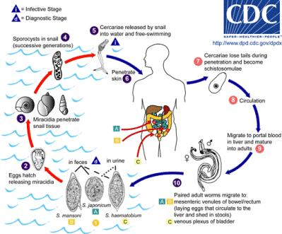
</div>

## Modification of behavior: toxoplasmosis $\mathcal \Pi$

Caused by the protozoan *Toxoplasma gondii*, can only reproduce in cats and other *Felidae*. Rodents can become infected by consuming infected faeces. Interestingly, infected rodents become "more extrovert" and lose their fear of cats.

Several published articles show that toxoplasmosis affects human behavior as well (e.g., much higher probability of traffic accident)---including their "national culture" (see Lafferty 2006).

In humans toxoplasmosis can be very common (up to 80% incidence), and is typically aquired by eating undercooked meat, or exposure to cats. 

## Gordian worm $\mathcal \Pi$

<div class="centered">
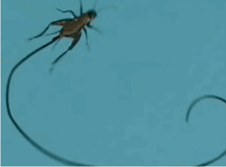
</div>

Interesting [TED Talk by Ed Yong](https://goo.gl/UItDdP)

## Summary

- Infectious diseases have played a prominent role in history

- Simple mathematical models can help understand disease dynamics, including size of the epidemics

- $\mathscr R_0$, measuring the number of new infections caused by the first infective, is a critical parameter

- For any disease outbreak, a (possibly small) proportion of the population is left untouched

- This is because the susceptibles that "fuel" the disease become difficult to find

## Summary
- Diseases with small $\mathscr R_0$ can be eradicated through mass-vaccination

- Mass vaccination provides herd immunity for those still susceptible (newborns, immunodepressed)

- More complex models are needed for diseases with complex life cycle

- More precise predictions can be made by measuring contact network and modeling spatial spread
